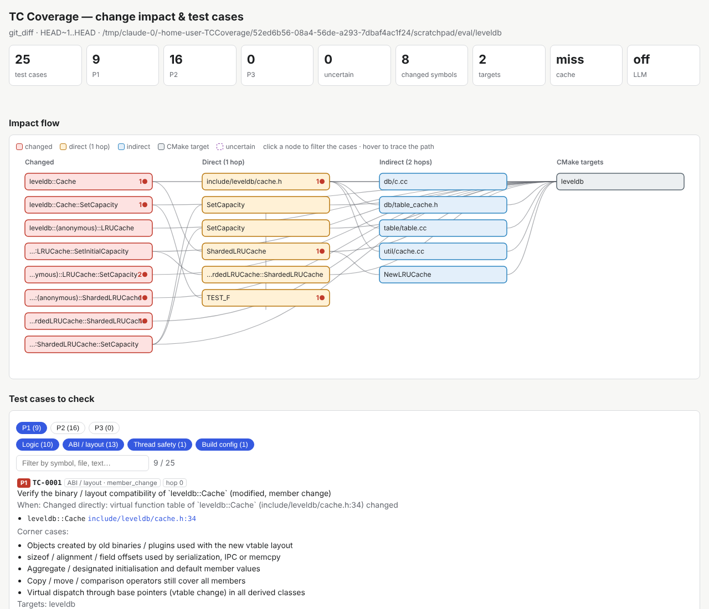

# TCCoverage — Change Impact & Test Case Advisor

For a C++/CMake change, `tcadvisor` tells you **which test cases to check**: the changed symbols,
their risk category (logic, ABI/layout, ownership/lifetime, thread safety, exception safety, build
config), every caller / subclass / user / includer up to N hops, corner cases to exercise, the CMake
targets to rebuild/retest, and the blind spots that need manual review. Results come as Markdown,
JSON, a token-lean brief, and an **interactive HTML impact-flow report**.



**Impact comes from a code graph** (codegraph by default, GitNexus opt-in, or the built-in libclang graph);
**AI only verifies** the deterministic cases and adds corner cases — see [docs/workflow.md](docs/workflow.md)
for the agent/model workflow and the product-development cycle. Real-project evaluation on
google/leveldb: [specs/002…/eval.md](specs/002-graph-providers-ai-verify/eval.md). **Pilot on large projects**
(COVESA vsomeip 133k LOC, RocksDB 898k LOC; 23 real regressions, 0 missed, 87 % at the fixed function):
[specs/003…/pilot.md](specs/003-pilot-large-projects/pilot.md). **Cycle 4** (55 regressions, dev/holdout):
0 missed, 51/55 at the fixed function, MRR ~0.12 → ~0.35, the later-fixed function in the first 10 cases for 26/55
(29/55 with the optional AI-triaged view) —
[specs/004…/results.md](specs/004-ranking-and-recall/results.md).

Three front-ends share the same engine:

| Front-end | Where | Use |
|---|---|---|
| CLI | `tcadvisor analyze …` | CI / pre-submit, scripting |
| Claude Code | `/tc-coverage HEAD~1..HEAD` (skill) + `tc-coverage-analyst` subagent | conversational review with concrete test scenarios |
| VS Code | `vscode-extension/` (`.vsix`) | tree of cases, inline hints, report webview |

## How it works (deterministic first)

1. **Index** every translation unit of `compile_commands.json` with libclang: functions, classes, macros and
   their `call`, `inherit_override`, `uses_type`, `instantiate`, `macro_expand`, `include` edges. Cached per TU in
   SQLite keyed by content hashes → only changed TUs are re-parsed.
2. **Diff → changed symbols**: each changed file is parsed old/new; symbols are compared on comment-free
   token streams, so comment/format-only edits yield *no detected impact*.
3. **Risk rules** (additive) classify each change; **traversal** walks dependents up to `--max-hop-depth` (2).
4. **Cases** per (impacted node × risk group) with deterministic priority: direct + high-severity = P1,
   direct or high-severity = P2, else P3. Every case carries file:line evidence (evidence gate).
5. **Uncertainty flags**: uninstantiated templates, DI/virtual-only methods, callbacks/function pointers,
   macro branches not compiled in any configuration.
6. Optional local LLM (Ollama) may only reword descriptions; off by default and degrades gracefully.

## Third-party API boundaries

When the analysed module only contains its own code, its libraries are visible as **declarations** only
(headers on the include path of `compile_commands.json`). A changed line that calls such a function gets one
case on the calling function (`sub_reason: external_call`, never propagated to its callers) whose corner cases
come from the declaration and the call site: null pointer return, failure / sentinel return (and whether the
result is ignored), may throw (C++ linkage, not `noexcept`), out-parameters, callbacks, pointer + length pairs.
The call also stays an uncertainty flag: the library's behaviour is not in the graph. Standard-library calls
are only counted in `run_notes`.

Behaviour a declaration cannot show is recorded once, by hand, in `.tcadvisor/external-contracts.json` of the
analysed repo (or `--contracts FILE`); keys are qualified names or `fnmatch` patterns:

```json
{
  "vendor_send": ["returns -EAGAIN when the send queue is full"],
  "vendor::*":   ["not thread-safe: one channel per thread"]
}
```

Matching entries appear as `Contract: ...` corner cases. Nothing leaves the machine; no model is involved.

## Lessons-learned cases

Besides the changed code and its callers, the report points at the *other* code that regressions came from in
practice (spec 006, all deterministic, off with `--no-patterns`):

| Pattern (`pattern`) | Lesson | Case on |
|---|---|---|
| `data_path_emitter` / `_forwarder` | A changed what it produced; B and C were untouched, C forwarded it and sent wrong data | the function that finally sends the data (send / write / publish-like call, third-party API), with the full path A → B → C; forwarders lower |
| `sibling_source` | a function triggered from 4 places was protected in one | every other caller / registered callback without the same guard |
| `symmetric_counterpart` | encode changed, decode not | decode / close / unlock / unregister … |
| `same_code_elsewhere` | the fixed line was copy-pasted | other functions containing it |
| `new_enum_value` | new enumerator fell into `default:` | switch sites over the enum |
| `return_meaning` | new error code treated as success | callers deciding on the result |
| `shared_state` | new value / timing of a member | readers of the member / global |
| `new_early_exit` | new `return` leaked a lock | the changed function (what was acquired before the exit) |
| `config_reader` | setting read differently in two places | other readers of the setting |

Data paths are traced with libclang over the translation units they need (`--flow-max-tus`, default 60,
cached); where a value leaves what can be followed (stored in a member or a container, budget reached) an
uncertainty flag says where. A reason found on code that already has a case is folded into that case.

Team knowledge goes into `.tcadvisor/lessons.json` (or `--lessons FILE`):

```json
{
  "sinks": ["ipc_post*", "Bus::emit"],
  "lessons": [{"id": "L7", "title": "Units", "when": {"tokens_any": ["timeout_ms", "delay"]},
               "ask": "Check every caller passes milliseconds"}]
}
```

`sinks` extend the emitting points of data paths; a lesson whose `when` matches (tokens of the change,
`name_glob`, `path_glob`, `sub_reason`) adds `Lesson L7 (Units): …` to the case.

## Test report (fill in, attach evidence, submit)

`report.html` is also the verification record of the change. Per case: **Pass / Fail / Cannot be tested /
Cannot occur**, comment, tester, date, defect reference and attachments (screenshots, logs, any file —
embedded in the file). Rules: *Cannot be tested* / *Cannot occur* need a justification, *Fail* needs an
attachment or a defect reference. **Save report** writes a new single HTML file with everything inside
(VS Code: save dialog); **Print / PDF** gives a printable record. Above `--attachment-warn-mb` (50) the
report warns about its size.

```bash
tcadvisor results filled.html            # summary; exit 0 complete, 4 incomplete or any Fail
tcadvisor analyze ... --previous-report filled.html   # after more edits: results carried over by case key,
                                                      # 'needs re-check' where the code behind a case changed
```

Each case has a stable `key` (what the case is about, not its position) and a `code_fingerprint`. A new
analysis never silently drops a filled report in its output directory: it is copied to
`report.results-backup-<time>.html` first.

## Graph providers

```bash
npm i -g @colbymchenry/codegraph     # MIT — default for --graph auto
npm i -g gitnexus                    # optional; PolyForm-Noncommercial license, check before commercial use
tcadvisor analyze ... --graph auto|codegraph|gitnexus|clang
```

With a graph provider the libclang index is replaced by a fast `#include` scan (`--index auto|full|lite`),
so ~1M-line code bases analyse in minutes. With codegraph/GitNexus a compile database is optional (results are marked *reduced accuracy* without it);
with it, change classification and CMake target mapping are exact.

## AI verification (optional, explicit opt-in)

```bash
tcadvisor verify ../tcadvisor-report/report.json --ai-external-approved   # Haiku per batch + 1 Sonnet call
```

Sends only packed code windows (≤40 lines per impacted symbol) through the Claude Code CLI. Verdicts are
annotations; no case is ever removed by a model.

## Install

```bash
pip install -e .            # Python ≥ 3.11, pulls the libclang wheel
```

Prepare the analysed project once (the advisor only reads these artifacts, it never configures your build):

```bash
mkdir -p build/.cmake/api/v1/query && touch build/.cmake/api/v1/query/codemodel-v2
cmake -S . -B build -DCMAKE_EXPORT_COMPILE_COMMANDS=ON
```

## CLI

```bash
tcadvisor analyze --repo /path/repo --build-dir /path/repo/build --commit-range HEAD~1..HEAD \
                  --output-dir ../tcadvisor-report [--targets RemoteDoorLock,RemoteDoorUnlock]
tcadvisor analyze ... --working-tree                 # uncommitted changes
tcadvisor analyze ... --symbols rca::RemoteDoorLock::processOrderResp
tcadvisor analyze ... --print brief                  # compact output for AI assistants / PR comments
tcadvisor render ../tcadvisor-report/report.json     # re-render md/html
tcadvisor cache clear --repo /path/repo
```

Exit codes: 0 ok · 1 prerequisite (compile db / File API missing or stale) · 2 usage · 3 internal.
Outputs: `report.md` (with Mermaid flow), `report.json` (schema: `specs/001-change-impact-test-advisor/contracts/output-schema.json`),
`report.html`, `report.brief.txt`.

## Claude Code

Open this repo (or copy `.claude/skills/tc-coverage` and `.claude/agents/tc-coverage-analyst.md` into your
project's `.claude/`) and run `/tc-coverage HEAD~1..HEAD`. Claude runs the CLI with `--print brief`, reads
only evidence windows for P1 cases, and answers with concrete test scenarios — the expensive dependency
tracing is never done by the model, which keeps token usage small. Speckit commands for Claude:
`/speckit-specify`, `/speckit-plan`, `/speckit-tasks`, `/speckit-implement`, …

## VS Code

```bash
cd vscode-extension && npm install && npm run compile && npx @vscode/vsce package
code --install-extension tc-coverage-0.1.0.vsix
```

See `vscode-extension/README.md`.

## Development

```bash
pip install -e '.[dev]' && python3 -m pytest -q
```

Spec-driven docs: `specs/001-change-impact-test-advisor/` (spec, plan, tasks). Project rules:
`.specify/memory/constitution.md`. Remaining acceptance step: pilot run on `remotecontrolapp`
(tasks.md T032).
