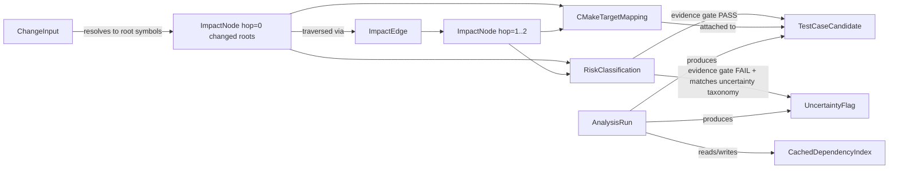

# Phase 1 Data Model: Change Impact & Test Case Advisor (MVP)

**Input**: Key Entities section of [spec.md](./spec.md), decisions from [research.md](./research.md)

This document defines the in-memory/persisted shape of each entity named in the spec's Key
Entities section. These are logical models (field + type + validation rule), not database DDL;
the SQLite cache schema (research.md §3) is an implementation detail derived from this model, not
a separate source of truth.

## ChangeInput

The unit of analysis submitted to the advisor (FR-001, FR-001a).

| Field | Type | Notes |
|---|---|---|
| `mode` | enum: `git_diff` \| `explicit_symbols` | Determines which of the two input shapes below applies. |
| `commit_range` | string (nullable) | Required when `mode = git_diff` and analyzing a commit range (e.g., `abc123..def456`). Mutually exclusive with `working_tree = true`. |
| `working_tree` | bool | Required when `mode = git_diff` and analyzing uncommitted working-tree changes. |
| `symbols` | list[SymbolRef] (nullable) | Required when `mode = explicit_symbols`. Each entry MUST be a function/method or class symbol — **never** a bare file path (FR-001a validation rule). |
| `target_repo_path` | path | Absolute path to the repository root being analyzed (read-only access). |

**Validation rules**:
- `mode = explicit_symbols` → every `SymbolRef.kind` MUST be `function`, `method`, or `class`; a
  `SymbolRef` with only a file path and no symbol name is rejected at ingest with a clear CLI error
  (enforces FR-001a).
- `mode = git_diff` → exactly one of `commit_range` or `working_tree` must be set.

## SymbolRef

A reference to a specific C++ symbol, used both for explicit input and for evidence fields.

| Field | Type | Notes |
|---|---|---|
| `qualified_name` | string | Fully-qualified symbol name (e.g., `rca::RemoteDoorLock::processOrderResp`). |
| `kind` | enum: `function` \| `method` \| `class` \| `struct` | |
| `file_path` | path | Source/header file where the symbol is declared/defined. |
| `line` | int | 1-based line number of the declaration/definition used as the anchor. |

## ImpactNode

A file, class, or function identified as directly or indirectly affected (FR-002).

| Field | Type | Notes |
|---|---|---|
| `symbol` | SymbolRef | The affected symbol. |
| `hop_distance` | int, `1` or `2` (MVP default max) | `1` = direct; `2` (or configured depth) = indirect. Enforced ≤ configured `max_hop_depth` (default 2). |
| `edges` | list[ImpactEdge] | One or more edges connecting this node back toward the changed root node(s); a node may be reachable via multiple paths, all retained for evidence completeness (Principle VII: recall over suppression). |

## ImpactEdge

The specific graph relation justifying an ImpactNode's inclusion (FR-002).

| Field | Type | Notes |
|---|---|---|
| `relation` | enum: `call` \| `inherit_override` \| `include` \| `instantiate` \| `link_to_target` | |
| `from_symbol` | SymbolRef | |
| `to_symbol` | SymbolRef | |
| `source_location` | {file_path, line} | The exact call-site/include-line/instantiation-site evidence (Principle II: concrete, checkable evidence). |

## RiskClassification

One or more risk groups assigned to a change (FR-003), computed deterministically (research.md §6).

| Field | Type | Notes |
|---|---|---|
| `risk_group` | enum: `logic` \| `abi_layout` \| `ownership_lifetime` \| `thread_safety` \| `exception_safety` \| `build_config` | |
| `sub_reason` | enum (per group) | e.g., for `abi_layout`: `header_change` \| `member_change` \| `signature_change` \| `inline_change`; for `ownership_lifetime`: `raw_pointer` \| `reference` \| `move_semantics`; for `thread_safety`: `mutex` \| `atomic` \| `lock_order`; for `exception_safety`: `noexcept_change` \| `throw_added`; for `build_config`: `macro` \| `target` \| `debug_release`. `logic` has no sub-reason (default/fallback group, per spec Assumptions). |
| `evidence` | SymbolRef or ImpactEdge | The concrete signal that triggered this classification (e.g., the specific member reorder, the specific new `std::mutex` declaration). |
| `affected_build_configs` | list[string] (nullable) | Populated only for `build_config` risk group when configurations can be determined from `compile_commands.json` entries; otherwise this triggers an UncertaintyFlag per the Edge Cases section of spec.md. |

**Validation rule**: a single changed symbol MAY produce multiple `RiskClassification` entries
(additive model, research.md §6) — never forced into a single mutually-exclusive label.

## TestCaseCandidate

The fundamental output unit (FR-004, FR-004a, FR-006). This is the **only** kind of actionable
item the tool emits to a reviewer (Principle I).

| Field | Type | Notes |
|---|---|---|
| `id` | string | Stable, unique within a single Analysis Run (e.g., `TC-0001`). Re-running on an unchanged commit (cache hit) MUST reproduce the same ids for the same underlying evidence. |
| `description` | string (English) | Human-readable explanation of what to check. Produced by the LLM step when enabled, or by the deterministic template renderer when disabled/degraded (FR-012a). |
| `activation_condition` | string (English) | Why/when this case applies to the current diff — must reference the specific change (e.g., "because `processOrderResp` now locks `mutexA` before `mutexB`"). |
| `evidence` | list[SymbolRef or ImpactEdge], min length 1 | **MUST** be non-empty (FR-006 / Principle II evidence gate). A candidate failing this constraint is never emitted. |
| `priority` | enum: `P1` \| `P2` \| `P3` | Derived deterministically from `(hop_distance, risk_group severity)` per FR-004a — never freely assigned by the LLM. |
| `risk_group` | one of RiskClassification.risk_group | The risk group this case was generated for; a symbol with N risk classifications may generate up to N related (but distinct) cases. |
| `related_cmake_targets` | list[string] | Populated from CMakeTargetMapping for the evidence's file(s) (FR-005). |

## CMakeTargetMapping

Association between a file and its owning CMake target(s) (FR-005), sourced from CMake File API
(research.md §2).

| Field | Type | Notes |
|---|---|---|
| `file_path` | path | |
| `target_names` | list[string], min length 1 for any file inside the analyzed scope | A file may map to more than one target (e.g., a shared header consumed by two libraries — spec User Story 3, Acceptance Scenario 2). |

## UncertaintyFlag

An explicitly reported blind spot (FR-007), kept structurally distinct from TestCaseCandidate so
it can never be silently conflated with — or silently dropped in favor of — a confirmed case
(Principle IV).

| Field | Type | Notes |
|---|---|---|
| `category` | enum: `uninstantiated_template` \| `dynamic_runtime_dependency` \| `di_config_routing` \| `build_config_incomplete_macro` | Fixed minimum taxonomy per constitution's Technology & Tooling Constraints; may only grow via constitution amendment. |
| `reason` | string (English) | Concrete explanation (e.g., "template `Foo<T>` has no visible instantiation in the indexed translation units"). |
| `related_symbol` | SymbolRef (nullable) | The symbol this uncertainty pertains to, when resolvable; may be null only for truly module-scope uncertainties (e.g., "Release-only `compile_commands.json`, Debug macro branch unanalyzed"). |

## AnalysisRun

One execution of the advisor (FR-012, FR-012a, SC-001 through SC-006 measurement).

| Field | Type | Notes |
|---|---|---|
| `run_id` | string (UUID or timestamp-based) | |
| `change_input` | ChangeInput | What was analyzed. |
| `commit_hash` | string (nullable) | Resolved commit hash for `git_diff` mode; null for `explicit_symbols` mode. |
| `started_at` / `completed_at` | datetime | Used to compute run time (SC-001). |
| `cache_hit` | bool | True if the per-commit cache was reused without a full re-index (SC-003). |
| `split_into_modules` | list[string] (nullable) | Populated when the diff exceeded ~50 files and was split per CMake target (FR-010a). |
| `llm_enabled` | bool | |
| `llm_degraded` | bool | True if LLM was enabled but unavailable/errored during this run and the deterministic fallback was used (FR-012a). |
| `llm_token_usage` | {prompt_tokens, completion_tokens} (nullable) | Recorded only when `llm_enabled = true` and not degraded (FR-012). |
| `test_case_candidates` | list[TestCaseCandidate] | |
| `uncertainty_flags` | list[UncertaintyFlag] | |
| `target_scope` | list[string] | CMake targets actually analyzed (FR-016 pilot scope: `RemoteDoorLock`, `RemoteDoorUnlock`). |

## CachedDependencyIndex

The persisted, per-commit-keyed representation enabling incremental re-analysis (FR-010, FR-010a).

| Field | Type | Notes |
|---|---|---|
| `module_root` | path | The analyzed module's root (keys the whole cache file). |
| `file_hashes` | map[file_path → content_hash] | Used to detect which files changed since the last indexed commit, enabling subgraph-only invalidation. |
| `symbols` | list[SymbolRef] | All indexed symbols. |
| `edges` | list[ImpactEdge] | All indexed relations. |
| `target_mapping` | list[CMakeTargetMapping] | |
| `last_indexed_commit` | string | Commit hash the cache currently reflects. |

**Invalidation rule**: when a file's `content_hash` changes relative to the stored value, only
that file's symbols/edges (and anything transitively depending on them, per the graph) are
recomputed and rewritten; unaffected rows are untouched (constitution Technology & Tooling
Constraints: "changed files invalidate only the affected subgraph of the cache").

## Relationships Overview

